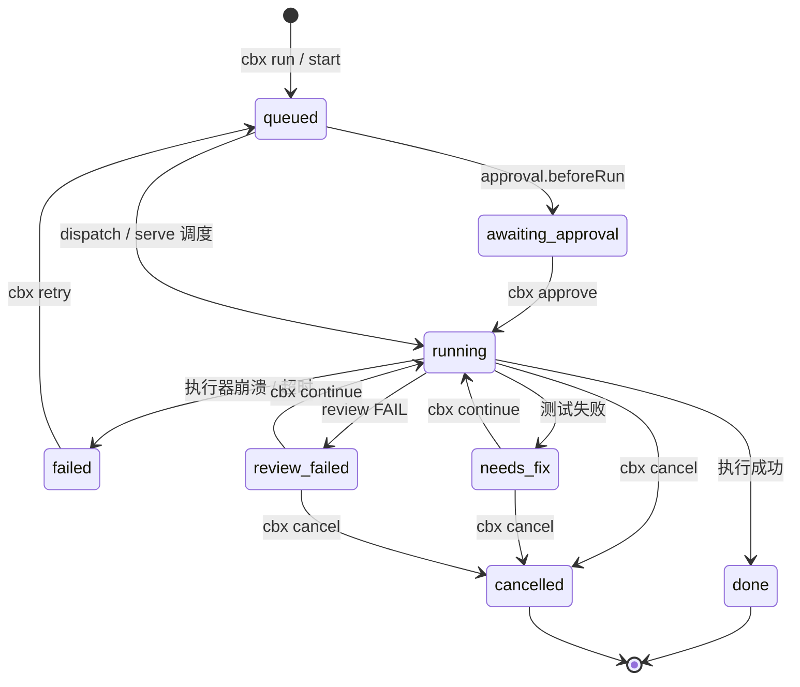
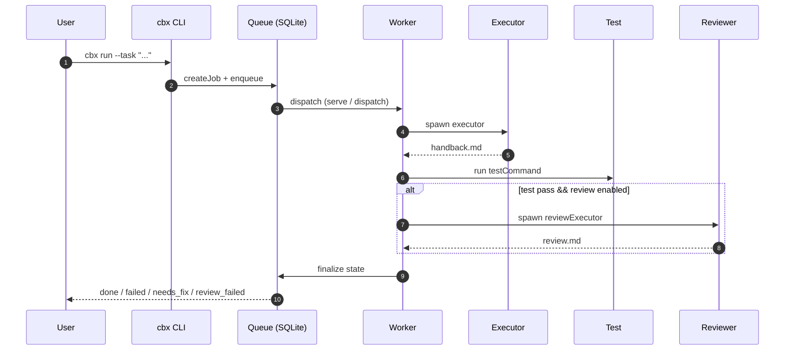
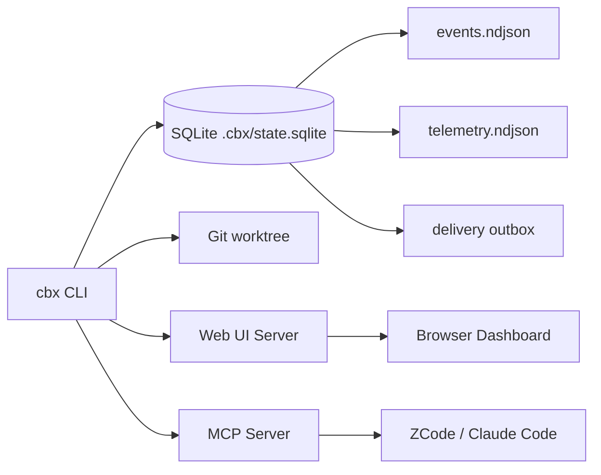

# CBX Orchestrator (`cbx`)

基于 Node.js + TypeScript 的本地编排器，把任意 AI 编码 CLI（CodeBuddy / OpenCode / Pi 等）固成一条可持久化的流水线：

```text
创建任务 → 执行 → 保存原始日志 → 跑测试 → 生成 diff → 审查 → 必要时返工
```

任务状态、事件流、测试日志、diff、审查报告全部落盘，进程崩溃后仍可恢复与续跑。

## 快速开始

全局安装（发布到 npm 后）：

```powershell
npm install -g cbx-orch
```

开发模式（从源码构建）：

```powershell
npm install
npm run build
```

源码仓库不包含 `dist/`；以下 `node .../dist/src/cli.js` 示例均以已经执行上述安装和构建命令为前提。若通过 npm 全局安装，则可直接把 `node .../dist/src/cli.js` 替换为 `cbx`。

在目标代码仓库中运行（默认执行器为 `codebuddy`）：

```powershell
node C:\path\to\cbx-orch\dist\src\cli.js run `
  --workspace . `
  --task "实现用户登录功能" `
  --test "npm test" `
  --timeout-ms 1800000 `
  --max-retries 1 `
  --review
```

指定执行器（例如 OpenCode）：

```powershell
node dist\src\cli.js run --workspace . --executor opencode --task "修复登录 bug" --test "npm test" --review
```

查询任务：

```powershell
node dist\src\cli.js status JOB_ID
node dist\src\cli.js review JOB_ID
node dist\src\cli.js continue JOB_ID --message "修复 review.md 中的问题"
node dist\src\cli.js clean JOB_ID
```

默认任务数据保存在目标仓库的 `.cbx/jobs/<job-id>/`，包括需求、状态、原始事件流、测试日志、diff 和审查报告。

## 架构概览

### 任务状态机



### 执行流水线



### 系统组件



## 执行器

`executor` 决定编排器实际调用哪个编码 CLI。内置 4 个适配器，也可指向自定义 ESM 插件。

| 执行器    | 注册名 / 别名       | 二进制      | 一次性调用                                                                    | 安装                                  | 覆盖 env        |
| --------- | ------------------- | ----------- | ----------------------------------------------------------------------------- | ------------------------------------- | --------------- |
| CodeBuddy | `codebuddy` / `cbc` | `codebuddy` | `-p "<prompt>" --output-format stream-json --max-turns N --permission-mode M` | `npm i -g @tencent-ai/codebuddy-code` | `CBX_CODEBUDDY` |
| OpenCode  | `opencode`          | `opencode`  | `run "<prompt>" --format json [--auto]`                                       | `npm i -g opencode-ai`                | `CBX_OPENCODE`  |
| Oh My Pi  | `omp` / `oh-my-pi`  | `omp`       | `-p "<prompt>" --mode json`                                                   | `npm i -g @oh-my-pi/pi-coding-agent`  | `CBX_OMP`       |
| Cline     | `cline`             | `cline`     | `--json "<prompt>" --auto-approve true\|false [--plan]`                       | `npm i -g cline`                      | `CBX_CLINE`     |

说明：

- `oh-my-pi` 是 Oh My Pi 的扩展框架，本身不是独立二进制，因此作为 `omp` 的别名。
- `--auto`（OpenCode）仅在 `permissionMode` 为 `auto` 或 `dontAsk` 时追加。Cline 始终显式传 `--auto-approve`：`auto`/`dontAsk` 为 `true`，`default`/`acceptEdits`/`plan` 为 `false`；`plan` 还会追加 `--plan`。
- Oh My Pi 的 CLI 文档未公开权限/放行 flag，因此当前不追加任何权限参数，由 omp 非交互 `-p` 默认行为决定；待其暴露后补齐。
- Cline 在 headless 模式默认 `auto-approve=true`，因此 cbx 对非自动模式显式关闭，避免受限权限被静默放宽。
- 四个 CLI 中只有 CodeBuddy 保留 `--max-turns`；其余靠 `--timeout-ms` 兜底。
- 通过对应的 env 变量可覆盖二进制路径，常用于测试或指向自定义脚本。
- 自定义插件：`executor` 指向一个 ESM 模块路径，模块导出 `run(request)`，返回 `{ code, output, timedOut }`。示例见 `plugins/example-executor.mjs`。

## 项目配置

在目标仓库根目录放置 `.cbx.json`，命令行参数会覆盖配置文件：

```json
{
  "executor": "codebuddy",
  "testCommand": "npm test",
  "review": true,
  "isolated": true,
  "timeoutMs": 1800000,
  "maxRetries": 1,
  "maxTurns": 50,
  "maxConcurrent": 2,
  "reviewRules": "重点检查鉴权、数据校验和回归测试。",
  "approval": { "beforeRun": true, "beforeComplete": false },
  "git": {
    "autoBranch": true,
    "autoCommit": true,
    "commitMessage": "chore: apply task"
  },
  "execution": { "trustMode": "trusted" },
  "dependencyGuard": true,
  "templates": {
    "bugfix": { "task": "修复 review.md 中的问题", "test": "npm test", "review": true },
    "feature": { "task": "实现新功能", "executor": "opencode" }
  },
  "adaptive": {
    "enabled": false,
    "maxRounds": 8,
    "managerExecutor": "codebuddy"
  },
  "context": {
    "tokenBudget": {
      "manager": 6000,
      "executor": 8000,
      "auditor": 8000
    }
  },
  "notifications": {
    "webhook": "https://example.test/cbx-events",
    "timeoutMs": 3000,
    "maxRetries": 2,
    "retryBaseMs": 100,
    "filters": {
      "events": ["job.state_changed"],
      "jobIds": ["job-123"],
      "statuses": ["done", "failed"]
    }
  },
  "telemetry": {
    "enabled": true,
    "endpoint": "http://localhost:4318/v1/traces",
    "serviceName": "cbx-orchestrator"
  },
  "governance": {
    "retentionDays": 30,
    "redactFields": ["token", "password", "authorization"]
  },
  "ui": {
    "token": "your-secret-token"
  }
}
```

任务管理：

```powershell
node dist/src/cli.js list --workspace .
node dist/src/cli.js list --all --workspace A --workspace B            # 跨 workspace 列出任务（带前缀）
node dist/src/cli.js ws --workspace A --workspace B                   # 跨 workspace 汇总（任务/队列/健康）
node dist/src/cli.js ws --workspaces-dir ~/code                       # 扫描含 .cbx 的子目录汇总
node dist/src/cli.js health --all --workspaces-dir ~/code             # 跨 workspace 健康汇总
node dist/src/cli.js batch --task "任务A" --task "任务B" --workspace .       # 批量创建任务
node dist/src/cli.js batch --task "A" --max-batch 2 --wait --workspace .    # 波次并发 + 等待终态汇总
node dist/src/cli.js logs JOB_ID --workspace .
node dist/src/cli.js files JOB_ID --workspace .
node dist/src/cli.js result JOB_ID --workspace .
node dist/src/cli.js export JOB_ID [--format text|markdown] --workspace .
node dist/src/cli.js approve JOB_ID --workspace .
node dist/src/cli.js queue --workspace .
node dist/src/cli.js queue pause --workspace .
node dist/src/cli.js queue resume --workspace .
node dist/src/cli.js retry JOB_ID --priority 10 --workspace .
node dist/src/cli.js watch JOB_ID --ci --workspace .
node dist/src/cli.js review-gate --workspace .          # 对工作区未提交改动跑独立审查（非零退出 = 有发现）
node dist/src/cli.js stop-review-gate                   # Stop hook 入口（stdin 读 cwd，fail-open 契约）
```

`cbx batch` 批量创建独立任务：`--task`/`--task-file` 可重复（可混用）；run 选项（`--executor`/`--review`/`--isolated` 等）透传到每个任务。`--max-batch N` 将批任务按 N 个一波分片入队（波间等上一波终态，不改变全局 `maxConcurrent`）；默认 0 = 一次全量入队。`--wait` 等待全部终态并输出成功/失败计数，超时（`--wait-timeout-ms`）返回未完成列表并以非零退出；批任务 job 与普通任务同构，可独立 `retry`/`continue`。

# 本地 Web UI / TUI
node dist/src/cli.js ui --workspace . --port 4173
node dist/src/cli.js ui --workspace . --port 4173 --ui-token your-secret-token
node dist/src/cli.js tui --workspace .

# 多 workspace 模式:一个 UI 看多个项目,顶部 workspace 选择器 + Dashboard 卡片
node dist/src/cli.js ui --workspace ~/code/proj-a --workspace ~/code/proj-b --port 4173
node dist/src/cli.js ui --workspaces-dir ~/code --port 4173  # 仅扫描直接子目录（1 层，不递归）
# 单 workspace 时 ws-list 自动隐藏;Dashboard 卡片和实时秒表对单/多模式都生效

# Web UI 接口（直接可读）
curl http://127.0.0.1:4173/                                    # HTML 仪表板
curl http://127.0.0.1:4173/events                               # SSE 实时事件流（支持 Last-Event-ID 回放）
curl http://127.0.0.1:4173/api/workspaces                       # 所有 workspace 状态摘要
curl http://127.0.0.1:4173/api/jobs                             # 任务列表
curl http://127.0.0.1:4173/api/jobs/<id>                        # 单个任务详情
curl http://127.0.0.1:4173/api/jobs/<id>/artifacts              # 可用 artifact 列表
curl http://127.0.0.1:4173/api/jobs/<id>/artifact/<name>        # 读取 artifact（handback.md / complete.patch / test.log / review.md 等）
curl http://127.0.0.1:4173/api/jobs/<id>/timeline               # 阶段时间线(stages + currentStage + elapsedSec)
curl http://127.0.0.1:4173/api/jobs/<id>/executor               # PID/heartbeat/命令 + 进程是否还活
curl http://127.0.0.1:4173/api/jobs/<id>/agent.log?since=0     # agent.log 增量(默认 256KB)
curl http://127.0.0.1:4173/api/queue                            # 队列状态
curl http://127.0.0.1:4173/healthz                              # 健康检查
curl http://127.0.0.1:4173/api/metrics                          # 运行指标

# Web UI 写操作（POST，需鉴权；浏览器自动携带 HttpOnly cookie，curl 需 Authorization: Bearer <token>）
curl -X POST http://127.0.0.1:4173/api/jobs/<id>/cancel         # 取消任务
curl -X POST http://127.0.0.1:4173/api/jobs/<id>/retry          # 重试失败任务
curl -X POST http://127.0.0.1:4173/api/jobs/<id>/approve        # 批准等待中的任务（before_run 批准后自动启动）
curl -X POST http://127.0.0.1:4173/api/jobs/<id>/continue       # 续跑（body: {message, priority, refresh_baseline, extra_rounds}）
curl -X POST http://127.0.0.1:4173/api/queue/pause              # 暂停队列
curl -X POST http://127.0.0.1:4173/api/queue/resume             # 恢复队列

# CI 模式：任务失败时返回非 0 退出码
node dist/src/cli.js run --ci --workspace . --task "实现某功能" --test "npm test"

# 单次调度：回收死 worker 并启动排队任务
node dist/src/cli.js dispatch --workspace .

# 常驻调度器：启动时回收死 worker，随后按间隔调度；SIGINT/SIGTERM 会停止调度器
node dist/src/cli.js serve --workspace . --interval-ms 30000

# 不含任务正文的健康与运行指标
node dist/src/cli.js health --workspace .
```

`ui` 命令支持 token 鉴权：通过 `--ui-token <token>` 或 `.cbx.json` 的 `ui.token` 配置。启用后浏览器首次加载首页会收到 `cbx_token` HttpOnly cookie（`SameSite=Strict`），同源 API/SSE 请求自动携带——token 不进入页面 JS 作用域、不出现在 URL 查询串，降低 XSS 与浏览器历史泄露面。curl/API 客户端仍可用 `Authorization: Bearer <token>` 请求头；SSE 兼容旧客户端可传 `?token=<token>` 查询参数。`/healthz` 健康检查和 `/` 首页无需 token。

### SSE 事件回放

`/events` 端点支持标准 `Last-Event-ID` 回放机制：每个事件携带 workspace 内单调递增的 `seq`（持久化于 SQLite，进程重启后续编）。客户端连接时带上 `Last-Event-ID` 头（或 `?last_event_id=` query），服务端自动补发 `seq > lastEventId` 的历史事件（上限 1000 条，超限发 `replay_truncated` 警告并只补最近 N 条）。浏览器 `EventSource` 在断线重连时自动携带 lastEventId，无需前端改动。无 lastEventId 时只推新事件（保持旧行为）。

### 上下文包 token 预算

上下文包在打包时按 per-role token 预算裁剪（启发式估算：ASCII ≈ chars/4，CJK ≈ chars/1.5）。默认 manager 6000 / executor 8000 / auditor 8000 tokens，可经 `.cbx.json` 的 `context.tokenBudget.{manager,executor,auditor}` 覆盖（最小 100）。超预算时按优先级裁剪 taskContract 低优先字段（assumptions/rejectedOptions/decisions → constraints/relevantFiles → nonGoals；goal + acceptanceCriteria + stages 永不裁剪），再裁 recentFailure.retryReason 与 userInstructions。触发裁剪时 pack 标记 `truncated: true` 并记录 `estimatedTokens`。既有 24K 字符硬上限仍作为最终兜底。

### Stage 依赖声明

`taskContract.stages[].dependsOn` 接受前置 stage name 数组，用于声明阶段间依赖关系：

```json
{
  "taskContract": {
    "goal": "重构认证模块",
    "acceptanceCriteria": ["登录流程通过", "权限校验正确"],
    "stages": [
      { "name": "api", "executor": "codebuddy", "task": "实现后端 API" },
      { "name": "ui", "executor": "codebuddy", "task": "实现前端界面" },
      {
        "name": "integrate",
        "executor": "codebuddy",
        "task": "集成联调",
        "dependsOn": ["api", "ui"]
      }
    ]
  }
}
```

前置 stage 进入失败终态（review FAIL / 非零退出）后，后继 stage 标记 skipped 而非执行（失败传播），并记 `stage_skipped` 事件。stage 的 handback 注入会聚合所有 dependsOn stage 的交接文档。悬空依赖（引用不存在的 name）与循环依赖在任务创建时即被拒绝。当前层内仍串行执行（单 worktree 安全），物理并行执行为后续规划。

`continue` 默认将任务重新入队（后台执行）。加 `--foreground` 走前台同步语义（阻塞至完成）。

配置了 `approval.beforeRun` 后，任务会先进入 `awaiting_approval`，批准后才启动执行器。

`git.autoCommit` 会自动隐含开启 `isolated`（有提示，避免污染主工作区）；仅在 `git.autoBranch` 开启时，修改会提交到 `cbx/<job-id>` 分支，否则落在 worktree 的游离提交上。

后台 worker 是 detached 进程。可使用常驻 `serve` 监护队列；它启动时会回收死 worker，仍可用 `dispatch` 供 cron/计划任务执行。

`notifications.webhook` 接收任务状态事件；事件同时会写入 `.cbx/events.ndjson`。`notifications.filters` 可细分订阅：`events`（事件 type）、`jobIds`（payload.jobId）、`statuses`（payload.status）为可选字符串数组，AND 语义（多条件同时满足才投递）；未配置的维度不限制；不匹配的事件不入 outbox（本地 events.ndjson 仍全量）。webhook 和 OTLP 都支持 `timeoutMs`、`maxRetries`、`retryBaseMs`：待投递消息先进入 SQLite durable outbox，状态写入不等待网络；后台按有限指数退避投递，进程提前退出时由后续 cbx 进程继续处理。最终失败会落到 `.cbx/delivery-failures.ndjson`。任务 span 始终写入 `.cbx/telemetry.ndjson` 供本地排查；启用 `telemetry` 后才会按 OTLP/HTTP JSON ...

任务状态、队列、通知 outbox 和死信的权威数据存储在 `.cbx/state.sqlite`（WAL 模式、版本化 migration）；首次访问会无损导入旧的 `.cbx/jobs/*/state.json`、`queue.json` 和 `delivery-failures.ndjson`。这些 JSON/NDJSON artifact 会继续保留以便人工查看，但不再作为调度一致性的依据；worker 终态与对应队列条目、以及 retry 的状态重置与重新入队，均在同一 SQLite transaction 提交。常驻 `serve` 使用带续期与 fencing token 的工作区单实例租约，发现另一个存活实例会拒绝启动，丢失租约则主动停止。`/healthz` 与 `/api/metrics`、以及 `cbx health` 返回队列深度、任务状态计数、失败/重试、待投递和死信计数，且不包含任务正文。

## Executor 插件

`executor` 可以指向一个 ESM 模块。插件应导出版本化 `manifest` 和 `run(request)`；manifest 使用 `cbx.executor/v1`，包含 `name`、`version` 和最小能力声明（例如 `execute`）。示例见 `plugins/example-executor.mjs`：

```json
{ "executor": "./plugins/example-executor.mjs" }
```

默认兼容历史的仅 `run` 插件。生产环境可启用严格治理：`plugins.enforce=true` 时必须为插件配置 `allowPaths` 或 `allowSha256`，并且每个已配置的 allowlist 都必须匹配；缺少 manifest、未批准路径或摘要都会被拒绝。任务事件只记录内置适配器来源/版本，或插件名称、版本、能力和 SHA-256，不记录环境变量值。

```json
{
  "plugins": {
    "enforce": true,
    "allowPaths": ["./plugins/example-executor.mjs"],
    "allowSha256": ["replace-with-64-hex-character-sha256"]
  }
}
```

## 质量与发布

`npm run check` 执行类型 lint、格式检查和测试；`npm run coverage` 运行 Node 测试覆盖率并按 `scripts/check-coverage.mjs` 中的最低阈值（lines/branch/functions）校验，低于阈值即失败；`npm run audit` 检查高危依赖问题；`npm run sbom` 生成 CycloneDX SBOM。CI 在 Node 20、22 和 24 上执行这些确定性检查并上传测试、覆盖率和 SBOM 工件。

发布遵循 Semantic Versioning。源码仓库不跟踪 `dist/`；推送 `v*` tag 后，`.github/workflows/publish.yml` 会从源码构建它、运行测试，并用 `npm pack --dry-run` 校验待发布包确实包含 `dist/src/cli.js`，然后才发布到 npm（需在仓库 Secrets 配置 `NPM_TOKEN`）。`package.json.files` 仍明确限定 npm 包内容为 `dist/` 和文档，不包含源码与测试；`private` 已设为 `false`。

## MCP

最小 MCP 适配器，不依赖 MCP SDK。两种传输：

**stdio（默认，向后兼容）**：

```powershell
cbx mcp
```

**streamable HTTP（协议 2025-06-18，支持实时事件推送）**：

```powershell
cbx mcp --http --port 8931 --host 127.0.0.1 [--token <t>]
```

客户端把 MCP 配置从 `command: cbx mcp` 改为 `url: http://127.0.0.1:8931/mcp`（可选 `Authorization: Bearer <t>` 头）即接入。HTTP 模式启用 `resources/subscribe`：订阅 `cbx://job/<id>/events?workspace=<ws>` 后，该任务事件变化会经 SSE 推 `notifications/resources/updated`（通知为变更信号，数据经 `resources/read` 读增量 `{ events, next_offset }`）。仅绑定 loopback。

提供的工具：`cbx_start`、`cbx_status`、`cbx_review`、`cbx_continue`、`cbx_artifact`、`cbx_cancel`、`cbx_approve`、`cbx_list`、`cbx_logs`、`cbx_result`、`cbx_queue`、`cbx_queue_pause`、`cbx_queue_resume`、`cbx_retry`、`cbx_review_gate`（对工作区未提交改动跑独立审查，配合 `reviewGate.enabled` 的 Stop hook）、`cbx_clean`（清理任务遗留的 Git worktree，对应 CLI `cbx clean`）、`cbx_list_workspaces`（扫描指定 root 下含 `.cbx/` 的 workspace 并列出各自任务）。

MCP 还提供 `resources/list` 和 `resources/read`，可直接读取任务的 `result.json`、`events.ndjson`、`complete.patch`、`review.md`、`stage-*-handback.md` 等产物。

`permissionMode` 为 `dontAsk` 时，MCP 的 `cbx_start` 需要显式传 `allow_unsafe_permissions: true`（对应 CLI 的 `--dangerously-skip-permissions`），否则任务创建会被拒绝。

非平凡任务可在 `cbx_start` 中传结构化 `task_contract`（目标、验收标准、非目标、约束、相关文件、决策与假设）。执行器会先生成 `understanding.json`；存在阻塞问题时任务以 `needs_fix / awaiting_clarification` 暂停。创建任务时还会记录 Git commit、branch、dirty 状态及 dirty 内容指纹。`isolated: true` 且创建基线包含未提交内容时，任务会在创建 worktree 前以 `needs_fix / dirty_baseline` 暂停，避免未提交内容被静默遗漏；请先提交或清理这些内容，确认当前基线符合预期后再以 `refresh_baseline: true` 继续。隔离 worktree 随后固定从确认过的 commit 创建。非隔离任务仅在 HEAD 或 dirty 内容指纹相对创建基线发生漂移时暂停，dirty 内容未变时可正常执行。`review_executor` 可指定独立审查 CLI，默认仍沿用 `executor`。

`cbx_start` 还支持：`approval_before_complete`（测试+审查通过后，落 `done` 前再停一次审批门，对应 `.cbx.json` 的 `approval.beforeComplete`，批准入口同 `cbx approve`）；`adaptive`（对象，snake_case 字段 `enabled`/`max_rounds`/`manager_executor`，启用后由独立 manager executor 每轮决策跑哪个 stage，超出 `max_rounds` 触发 `needs_fix / adaptive_max_rounds` Human Gate，可用 `cbx_continue` 的 `extra_rounds` 续跑；`adaptive.enabled=true` 要求 `review=true`）。`cbx_continue` 支持 `extra_rounds`（1–100 整数，仅在 `max_rounds` Human Gate 等待时追加 adaptive 轮次）。

`result.json` 包含 changed files、handback、`stages` 数组（每阶段 exit code 与 review verdict）、测试与验收摘要、基线信息、`humanGate`（人工等待状态）及 artifact SHA-256。最终交付仍应通过 `cbx_artifact` 或 MCP resources 读取并核对 `handback.md`、`complete.patch`、`test.log` 和 `review.md`，不要只根据状态元数据总结。

## ZCode 插件

cbx 本身就是一个 ZCode 市场插件（仓库根含 `.zcode-plugin/plugin.json`、`commands/`、`skills/`）。安装后自动注册 cbx MCP server，并提供斜杠命令和技能，无需手写 MCP 配置。

### 安装

```powershell
# 1. 全局安装 cbx CLI（提供 cbx / cbx mcp 命令，依赖由 npm 自动解析）
npm install -g cbx-orch

# 2. 添加本仓库为市场源
zcode plugin marketplace add zerosloney/cbx-orch

# 3. 安装 cbx-orch 插件
zcode plugin install cbx-orch@cbx-orch-marketplace
```

安装后重启 ZCode 会话，插件 manifest 会调用全局安装的 `cbx mcp`，将 MCP server 自动以 `cbx` 名注册；工具暴露为 `mcp__cbx__cbx_*`。因此仅 clone 或安装插件目录并不足以启动 MCP，必须先确保全局 `cbx` 命令可用。

### 斜杠命令

| 命令                               | 作用                                                |
| ---------------------------------- | --------------------------------------------------- |
| `/cbx-run [task]`                  | 委派任务到 cbx，后台执行（含测试+审查），轮询至完成 |
| `/cbx-status [job_id]`             | 查任务状态/阶段/尝试                                |
| `/cbx-continue [job_id] [message]` | 按 review.md 或测试失败返工                         |
| `/cbx-list`                        | 列出当前工作区所有任务                              |
| `/cbx-queue [pause\|resume]`       | 查看或控制任务队列                                  |

### 技能

`cbx-orchestration` 技能文档（`skills/cbx-orchestration/SKILL.md`）指导 agent 何时用 cbx、如何选执行器、隔离策略。

### 用户配置

插件安装后，在 ZCode 设置中可配置（对应 `userConfig`）：

| 配置项     | 默认值      | 作用                                             |
| ---------- | ----------- | ------------------------------------------------ |
| `executor` | `codebuddy` | 默认执行器：`codebuddy`/`opencode`/`omp`/`cline` |
| `review`   | `true`      | 测试通过后是否跑独立审查                         |
| `isolated` | `true`      | 是否在 git worktree 中隔离执行                   |

### 工作区定位

插件通过 `CBX_WORKSPACE=${CLAUDE_PROJECT_DIR}` 把当前项目目录注入 cbx MCP server。调 `cbx_*` 工具时无需传 `workspace` 参数，默认即当前项目。

### 前置依赖

npm 发布包包含可直接运行的 `dist/` 编译产物；源码仓库不跟踪该目录。自行 clone 源码后，需先执行 `npm install && npm run build` 生成 `dist/`。还需至少安装一个执行器 CLI（codebuddy/opencode/omp/cline 之一）才能真正执行任务。Stop review-gate hook 通过 `cbx stop-review-gate` 子命令调用，只依赖全局 `cbx` 命令，不依赖插件目录内的 dist；MCP server 同样只依赖全局 `cbx` 命令。

## Claude Code 插件

cbx 同时是 Claude Code 市场插件（仓库含 `.claude-plugin/plugin.json` 与 `.claude-plugin/marketplace.json`，共用根目录 `commands/`、`skills/`、`hooks/`）。安装后自动注册 cbx MCP server，并提供斜杠命令和技能，无需手写 MCP 配置。

### 安装

```powershell
# 1. 全局安装 cbx CLI（提供 cbx / cbx mcp 命令，依赖由 npm 自动解析）
npm install -g cbx-orch

# 2. 添加本仓库为市场源
claude plugin marketplace add zerosloney/cbx-orch

# 3. 安装 cbx-orch 插件
claude plugin install cbx-orch@cbx-orch-marketplace
```

安装后重启 Claude Code 会话，插件 manifest 会调用全局安装的 `cbx mcp`，将 MCP server 自动以 `cbx` 名注册；工具暴露为 `mcp__cbx__cbx_*`。因此仅 clone 或安装插件目录并不足以启动 MCP，必须先确保全局 `cbx` 命令可用。

斜杠命令、技能、用户配置与 ZCode 插件完全一致（见上文表格），区别仅在于宿主客户端：`executor` / `review` / `isolated` 在 Claude Code 设置中配置（对应 `userConfig`），工作区定位同样通过 `CBX_WORKSPACE=${CLAUDE_PROJECT_DIR}` 注入。

### 前置依赖

同 ZCode：npm 发布包含 `dist/`；从源码安装需先 `npm install && npm run build`。Stop review-gate hook 通过 `cbx stop-review-gate` 子命令调用，只依赖全局 `cbx` 命令，不依赖插件目录内的 dist；MCP server 同样只依赖全局 `cbx` 命令。

## 安全说明

- 默认权限模式 `auto`。可通过 `--permission-mode` 或配置覆盖；`dontAsk` 需显式 `--dangerously-skip-permissions`。
- 测试命令由用户提供，会在目标工作区执行。cbx 只做有限黑名单过滤（正则可被变体绕过），**不保证命令安全**。建议始终用 `--isolated` 让测试在 worktree 内跑；非隔离时 cbx 会输出告警。
- Web UI / TUI 仅绑定本机回环（127.0.0.1/::1）。可通过 `--ui-token` 或配置 `ui.token` 启用 token 鉴权：浏览器走 HttpOnly cookie，curl/API 客户端走 Bearer header，`/healthz` 和首页保持开放。未配置 token 时不做鉴权。远程共享必须放在带认证的反向代理之后。
- `--isolated` 会创建 Git worktree，避免直接污染主工作区；**它不是 OS 安全沙箱**，不会隔离网络、凭据、宿主机文件或进程。
- 默认 `execution.trustMode` 是 `trusted`。`untrusted` 任务需要 OS 容器沙箱；当前 cbx 没有内置容器 runner，因此会明确拒绝启动该模式。可通过 `--trust-mode trusted|untrusted` 覆盖配置。
- `.cbx.json` 是严格 schema：未知字段、错误类型和越界值会拒绝加载，避免策略拼写错误静默失效。`governance.redactFields` 会递归脱敏事件、webhook 和死信中的同名字段；`governance.retentionDays` 会在状态更新和健康检查时原子压缩 `.cbx/delivery-failures.ndjson`，并同步清理过期 SQLite 死信记录。
- `--timeout-ms` 限制执行器和测试命令的单次执行时间。
- `--max-retries` 控制失败后的自动重试预算，默认 1。内部拆为两个独立计数器：执行器崩溃预算 `executionRetries = maxRetries+1`，测试/审查失败修复预算 `fixRetries = maxRetries`。执行器崩溃只消耗 `executionRetries`，测试/审查失败只消耗 `fixRetries`，避免 `needs_fix` 场景每轮白耗一次执行器重试。CLI 与 `.cbx.json` 的 `maxRetries` 语义不变。
- `--dependency-guard` / `.cbx.json` `dependencyGuard`（默认关闭）：开启后每个 stage 执行前后对 `package.json`、`package-lock.json`、`pnpm-lock.yaml`、`yarn.lock`、`bun.lockb` 取 SHA-256 baseline 比对，未授权改动触发 `needs_fix / dependency_guard` 并提示恢复或 `--no-dependency-guard` 关闭。仅做哈希比对，不阻止其他文件改动，也不替代 OS 沙箱。
- 默认任务完成或失败后清理 isolated worktree；使用 `--keep-worktree` 保留。
- 同一个任务不能并发执行；`cancel` 会终止进程树并留下取消标记。
